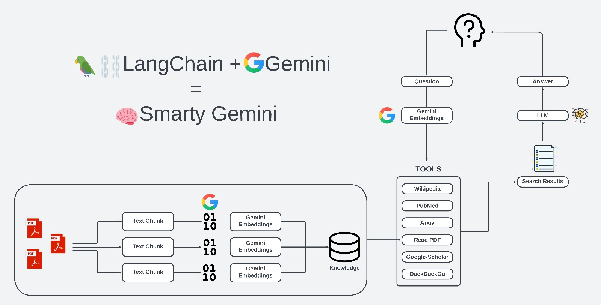

# 🧠Smarty-Gemini 
---

## Introduction
Welcome to the GitHub repository of Smarty-Gemini Agent, a sophisticated agent designed to meet a wide array of user needs through advanced language understanding and decision-making capabilities. Powered by Google's cutting-edge Gemini-pro Large Language Model (LLM), this agent integrates a suite of special tools to facilitate searches across various platforms including DuckDuckGo, Wikipedia, Google Scholar, ArXiv, and PubMed, alongside the capability to read and interpret PDF documents. 

## Features
- **Advanced Language Understanding**: At its core, the Gemini-Pro Agent leverages Google's Gemini-pro LLM, ensuring a deep comprehension of human language.
- **Dynamic Tool Selection**: The agent autonomously decides the most suitable tool or response for each query, optimizing user experience.
- **Versatile Search Options**: With integrated search capabilities across DuckDuckGo, Wikipedia, Google Scholar, ArXiv, and PubMed, users can find accurate information across the web and academic journals.
- **PDF Interpretation**: Ability to read and analyze PDF documents, extracting valuable insights and answers.
- **Web Interface**: A user-friendly web interface built using the Streamlit library, making it accessible for non-technical users.
- **Powered by Langchain**: Utilizes the Langchain library for efficient handling of API and LLM calls.



## Installation
To get started with the Gemini-Pro Agent, ensure you have Python installed on your system. Follow these steps to install the required packages:

1. Clone this repository:
```
git clone https://github.com/g-hano/Smarty-Gemini.git
cd smarty-gemini
```

2. Install required Python packages:
```
pip install -r requirements.txt
```

## Usage
After installation, you can utilize the Gemini-Pro Agent through its Streamlit web interface. Follow these steps to start interacting with the agent:

1. **Prepare PDF Files**: Place any PDF files you want the agent to read and interpret in a folder named `Gemini` within the root directory of the project. This ensures the agent can easily access and analyze your documents.

2. **Run the Application**: Execute the following command in your terminal to start the web interface:
   ```
   streamlit run app.py
   ```
   
Through the web interface, you can query the agent, request information from integrated search platforms, and have your PDF documents read and interpreted. The agent's advanced language understanding and decision-making capabilities will ensure you receive relevant and accurate responses.

This will start the web interface, where you can interact with the agent directly.

[Watch the usage video](https://github.com/g-hano/Smarty-Gemini/blob/main/doc/usage60.mp4)

## How It Works
The Gemini-Pro Agent uses the Langchain library to manage API and LLM calls, enabling it to interpret queries, decide the most appropriate tool or answer, and fetch data from various sources. The agent's decision-making process and language understanding capabilities are powered by Google's Gemini-pro LLM, ensuring high-quality responses.

## Resources I used in the project
- all html-css codes are belong to [alejandro-ao](https://github.com/alejandro-ao/ask-multiple-pdfs/tree/main)

## Contributing
We welcome contributions to the Gemini-Pro Agent project. If you're interested in improving the agent or adding new features, please fork the repository and submit a pull request.

## License
[MIT License](LICENSE.md)

---
